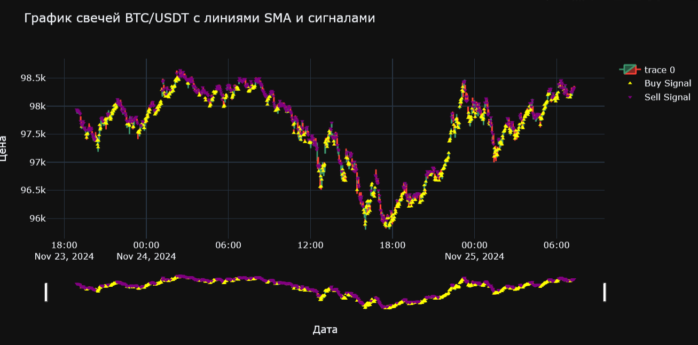
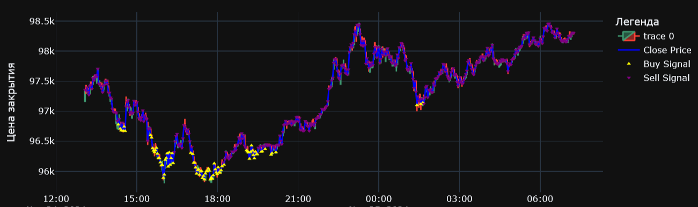

# trading_bybit_api

Collected historical data **BTC/USDT**. Selected the fastest and most effective model, using features such as **RSI, EMA, ATR, MA, AMA**, etc. I use **takeProfit/stopLoss**. The **pybit api** is used. **By selecting a threshold, you can minimize the number of unprofitable purchases.**

# Train

# Predict target

